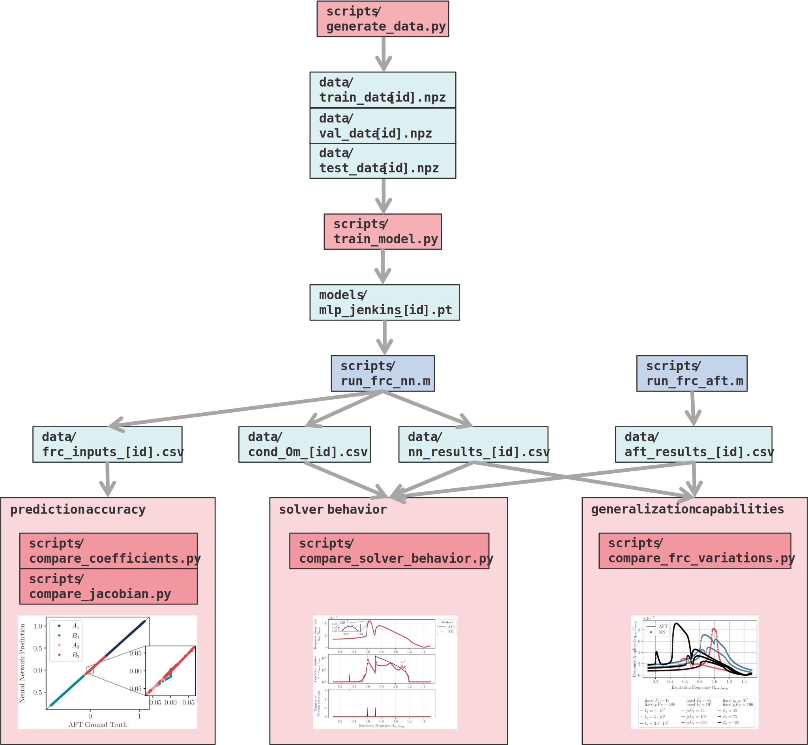

# wccm-eccomas-hbm-nn
This code accompanies the conference contribution  
**"Learning Nonlinear Forces for the Harmonic Balance Method Using Neural Networks"**  
presented at WCCM ECCOMAS 2026.  

**Authors**  
Miriam Goldack¹, Johann Groß², Malte Krack², Merten Stender¹  
¹Cyber-Physical Systems in Mechanical Engineering, Technische Universität Berlin, Germany  
²Institute of Aircraft Propulsion Systems, University of Stuttgart, Germany  

**Abstract**  
Damping vibrations through dry friction plays a crucial role in the safety, efficiency, and longevity of turbomachinery. One of the most relevant simulation methods in nonlinear structural dynamics for modeling systems with friction is the Harmonic Balance Method (HBM). It effectively solves the equation of motion in the frequency domain and represents the system response as a truncated Fourier series. The main bottleneck within this method is the Alternating Frequency-Time (AFT) method, which is used as standard for evaluating nonlinear force. The AFT applies an inverse FT transformation (FT) to evaluate the nonlinear force in the time domain and transforms the result back into the frequency domain using a direct FT, which overall is computationally demanding.  
In this work, we propose a neural network to replace the AFT. The network is trained for a specific type of contact nonlinearity and a fixed number of harmonics. It determines the Fourier coefficients of the nonlinear force given the normalized Fourier coefficients of the displacement without making use of the FT. Through automatic differentiation, the neural network even provides the derivatives of the nonlinear force coefficients with respect to the displacement coefficients, resulting in a more efficient and better-conditioned iterative solution process since the resulting Jacobi matrix can be used directly. Based on proof-of-concept studies considering a smooth cubic spring, we apply the method to a common dry friction element. The results are evaluated both regarding data fit by comparing to the corresponding coefficients computed by the AFT, and regarding the resulting system response obtained by integrating the neural AFT into the classic HBM procedure.


## Requirements & Installation
The project was developed with:

- Python 3.12.11  
- MATLAB R2025a  

The required MATLAB add-ons are:

- Optimization Toolbox
- Simulink
- Statistics and Machine Learning Toolbox

From the top-level repository directory (where `pyproject.toml` is located), install the dependencies and the package in editable mode to make the `src` modules importable from anywhere:

```bash
python -m pip install -e .
```

## Usage
Files to be executed can be found in scripts directory. Execute all files from project top-level e.g. <python3 scripts/generate_data.py>. 
To run matlab files use batch mode e.g. <matlab -batch "run('scripts/run_frc_nn.m')">

## Workflow Overview
The diagram below summarizes the overall process, including data generation, neural network training, and evaluation regarding prediction accuracy, solver behavior and generalization capabilities.  

All executable scripts for reproducing the results are in the folder [`scripts`](scripts). The folder [`src/hbm_nn`](src/hbm_nn/) contains helper functions.  

[](workflow.svg)

## Citation
If you use this code in your research, please cite:
```bibtex
@software{goldack2026wccm-eccomas-hbm-nn,
    author = {Goldack, Miriam},
    title = {Code for: Learning Nonlinear Forces for the Harmonic Balance Method Using Neural Networks},
    year = {2026},
    url = {https://github.com/MiriamAlina/wccm-eccomas-hbm-nn}
}
```

## License
GNU General Public License v3.0

## Contact
Miriam Goldack  
CPS-ME, TU Berlin  
m.goldack@tu-berlin.de
